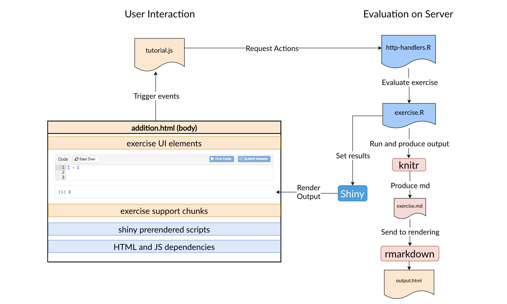

# `learnr`: a peek under the hood

### Background

> "Let us change our traditional attitude to the construction of programs: Instead of imagining that our main task is to instruct a computer what to do, let us concentrate rather on explaining to human beings what we want a computer to do." – Donald Knuth, Literate Programming (1984).

Data scientists engage in and develop tools for literate programming. A variant of markdown called rmarkdown has provided the foundation for several R packages to assist in writing books (bookdown), blogs (blogdown, hugodown), scientific reports for the web (distill) and presentations (xaringan). The trend with these packages and tools is to take the base R Markdown document and *extend* it to provide a powerful way to write documents in a simple markdown format, yet be able to embed complex mixed media such as code, images, videos, and interactive elements to better suit the type of artifact the user wants to create. But, there is yet another level of literate programming that is now possible for instructors who want to make interactive lessons thanks to the [learnr package](https://rstudio.github.io/learnr/index.html).

For my summer internship, Greg Wilson and Alison Hill initially tasked me with building Python lessons using the `learnr` package with the caveat that some infrastructure will need to be built. My journey involved a lot of reading and tracing code, as well as consulting Barret Schloerke, who provided me both knowledge about the trees and the forest of `learnr`. Greg advised I start making diagrams to describe the architecture and execution flows. This diagramming activity became a wonderful tool to identify my gaps of knowledge. Every time I came back to my diagrams, I had new knowledge to incorporate, which again opened up new gaps I needed to fill. In this post, I'd like to provide you with how I formed a working knowledge of this intricate package and less so on describing its specific features which others have described, including my fellow intern [Ezgi](https://education.rstudio.com/blog/2020/06/summer-camp-hs/). In the end, I hope to convey the big picture of `learnr` and the technologies it combines for interactive lessons.

### What is learnr?

If you haven't heard about the `learnr` package, let's briefly state its purpose from the [documentation](https://rstudio.github.io/learnr/index.HTML#Overview): 

> The learnr package makes it easy to turn any R Markdown document into an interactive tutorial.

For the rest of the post, we'll refer to this example of a learnr document that only includes an exercise and its hint/checking counterparts:


<!--Insert an image of the document and maybe highlight the main diffs with red marker or circle -->

If you have used the base rmarkdown, you will be familiar with components such as the YAML header, the setup code, and the knitr code chunks (the triple back-quoted elements). However, the red highlights shown here are the parts where learnr starts to diverge and *extend* R Markdown in the following ways: 1) the output is a `learnr::tutorial`, 2) the runtime is `shiny_prerendered`, 3) there is some `learnr`-related setup code, and 4) there are `knitr` chunks which have custom options such as `exercise`. These 4 main differences sets `learnr` apart from the `rmarkdown` that you are probably more familiar with and I'll refer to these in the next section covering the overall architecture of the package.

### Architecture behind `learnr`

> "It's a dangerous business, Frodo, going out your door... You step into the Road, and if you don't keep your feet, there is no knowing where you might be swept off to." - Bilbo Baggins.

The learnr package combines many tech stacks together, making it a difficult package to understand and traverse. However, I found a simple way to think about the package that might help you better grasp the technologies involved. learnr can broken down into two main parts: 1) **tutorial creation** and 2) **tutorial interaction**. These two parts allowed me to mentally organize how learnr is working under the hood as well as navigate associated R files involved in each part. This was also a pragmatic approach so I could make extensions to the code only where needed. Here is a high level view of these two parts and the technologies involved:


The interactivity is possible on the frontend which is made up of the familiar combination of HTML, CSS, and JS. But, there are also a few third-party JS dependencies like the [Ace editor](https://ace.c9.io), which is an important one because it provides the editor for exercises. The backend R code mainly consists of http handlers responding to events like "Next topic" and "Start over". R code using shiny is for handling events related to evaluating questions and exercises in response to events such as clicking the "Run" button.

From the document perspective, all you need to really know is that learnr turns your Rmd file into an HTML file using pandoc, which I like to think of as the bridge from the tutorial creation to the tutorial interaction side. At this point, you may skip to my reflections on learning learnr so far. But, those who are curious may continue to details of what's *really* going on under the hood for each side.

#### Tutorial creation


After you hit "Run document" in RStudio, learnr does some prep work and takes your `lesson.Rmd` file and uses rmarkdown and knitr to process and shape the final document. You can think of rmarkdown as "running the show" because it is responsible for rendering the entire Rmd from end-to-end with the help of learnr. learnr helps rmarkdown by specifying the custom output via `learnr::tutorial`, which is a souped-up HTML document. learnr also helps rmarkdown by processing the Rmd file and adding extensions not normally present in regular Rmd files. Finally, learnr uses gradethis to check results for exercises. Before we jump to the interaction side, let's briefly talk about some details on initialization.

**Package and Shiny server initialization:** learnr has two main jobs to do before we move on to the interaction side: 1) apply custom behavior for exercises and 2) setup up the Shiny server. Roughly this is what that process looks like:


The knitr package is used by learnr to add the magic of exercises and its counterparts via custom knitr hooks that activate on render time. These custom knitr hooks process the questions, exercises (for e.g., `exercise=TRUE`) and their associated support chunks using label suffixes like `-setup` for setup code, `-check` and `-solution` chunks for checking answers. While we process these custom code chunks, learnr also creats Shiny prerendered chunks for the HTML document, and starts the Shiny server. We are now ready to cross the bridge to the interaction side.

#### Tutorial interaction

Brace yourself for this next one:



Crossing the bridge over to interaction, the student can now see and interact with the tutorial, which is an HTML document. rmarkdown produced this document by using a custom output defined by a function in learnr, `learnr::tutorial`. learnr tutorials are designed to be *interactive* documents and is better thought of as a specialized Shiny app, not a static document. This is why you cannot knit a learnr Rmd document into arbitrary formats such as a pdf.

This HTML document you see here is special because it is actually a type of Shiny app using the `shiny_rendered` runtime. The shiny prerendered runtime means that some of the code are pre-executed (render context), while other code execute during interaction (server context) for performance reasons which you can read more about [here](https://rmarkdown.rstudio.com/authoring_shiny_prerendered.HTML#Overview). All you need to know here is that the shiny prerendered scripts included in the HTML will be used to get Shiny reactive values from the backend side (`exercise.R`). For tutorial state events such as "Start over" or "Next topic" button clicks, the `tutorial.js` will respond to these and notify `http-handlers.R` to make changes.

**Evaluating exercises:** When it comes time to evaluating an exercise, the `exercise.R` goes, "Alright, give me all of the code text submitted for this exercise. I'll evaluate this in an isolated R file and the environment it needs. Then I'll use knitr to produce the properly formatted regular markdown that rmarkdown can render, and set the results for the Shiny side." The shiny code within `exercise.R` then responds with, "Great! You have the output for the exercise, I'll let the frontend know."

And here's the script tag in the HTML document that makes this possible. 

```
<script type="application/shiny-prerendered" data-context="server">
`tutorial-exercise-addition-result` <- learnr:::setup_exercise_handler(reactive(req(input$`tutorial-exercise-addition-code-editor`)), session)
output$`tutorial-exercise-addition-output` <- renderUI({
  `tutorial-exercise-addition-result`()
})
</script>
```

It essentially setups the exercise handler setup, and the shiny function `renderUI` to retrieve html output after evaluating the exercise. The output is appended under the exercise, which could be an output for the "Run" button or some feedback for "Submit Answer" button.

### Reflections

Daniel Chen had mentioned in his [reflection]() last summer that he turned from a user of R to a developer of R. I would say I feel the same way so far. Although I knew how to use R packages, it wasn't until I had to venture into `learnr` that I realized that developing packages is a whole different ball game! From a developer's perspective, it has been a lot of fun making improvements to learnr because building and debugging the package is very fast and allows quick cycles. I also wouldn't have made it this far without the guidance of Greg and Alison with setting goals for each week and making sure I'm enjoying the work. Barret Schloerke has also been a tremendous help whenever I am stuck on a problem and I'm reminded how great it is to gain tacit knowledge from an expert. I now understand neat things like using vectorized operations such as vapply such over a for loop–thanks Barret!

So far, I've been able to make two pull requests adding enhancements to learnr. [PR #373](https://github.com/rstudio/learnr/pull/373) was my first easy one which involved allowing the instructor to suppress a confusing warning message about "invisible result". This PR gave me a good idea of the learnr package flow. [PR #390](https://github.com/rstudio/learnr/pull/390) was a much more difficult one which adds support for chaining setup chunks, which can alleviate the tedious process of building up setup code for incremental exercises as voiced by many. I am very excited to say that this particular PR also paves the way for a cleaner approach on non-R exercises, by changing how we process exercises, but that's for another post! 

Although we are not there yet to make Python lessons in learnr, I look forward to adding more infrastructure to make this dream possible *eventually*. 😁


