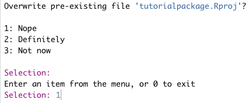
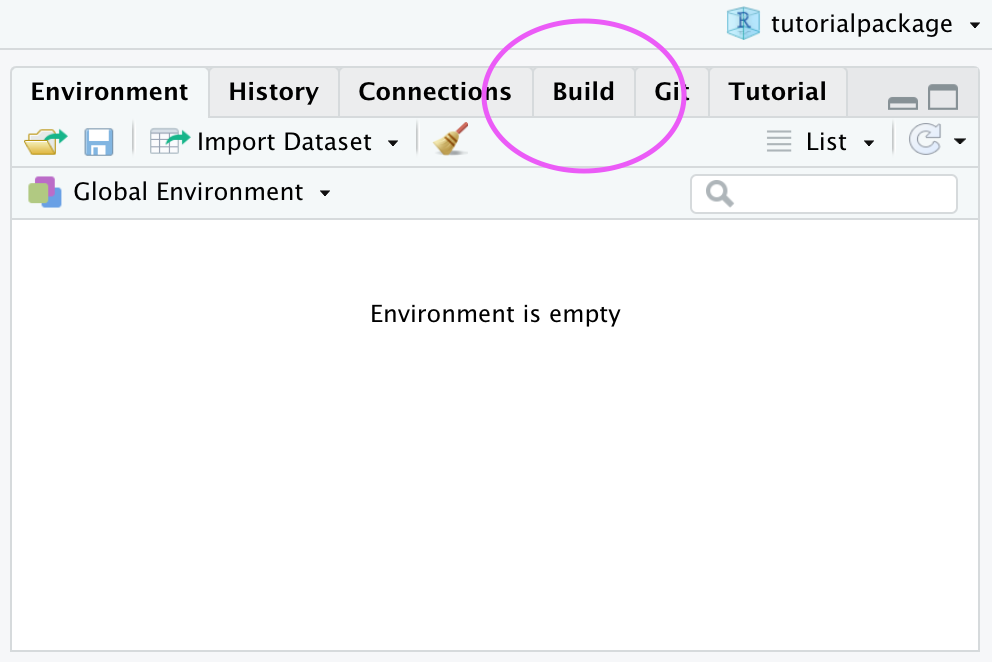
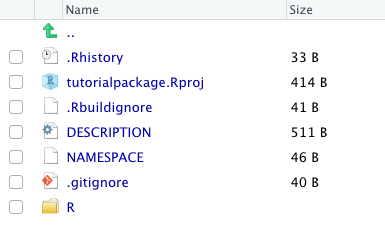
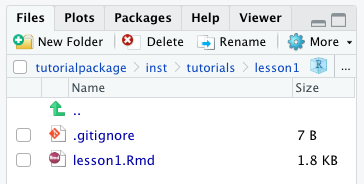
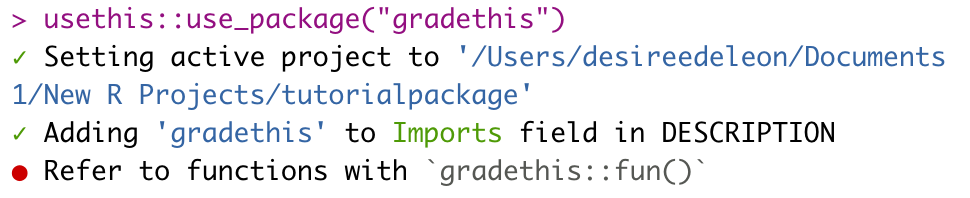

## A package for the learnr occasion


Packages are not just for functions and data-- you can create a package to deliver interactive tutorials to an audience, too!

If you want to share your [learnr tutorial](https://rstudio.github.io/learnr/) with a large group of users (e.g. large courses where many students will likely run the same tutorials simultaneously), putting your tutorial inside of a package may actually be one the *best* ways to get your content to your audience. Why? Because after the package has been installed and loaded, users can run your tutorial *locally*-- which means that *you* don't have to worry about potential bandwidth limits and issues that might otherwise arise when learnr tutorials are hosted on external servers.

Putting your learnr tutorial in a package is also free-- and always will be, which means you can also sidestep costs associated with hosting services! Your package doesn't have to be on CRAN, and it doesn't have to contain functions or data (but it can if you want!).

Never made a package before? No sweat! In this post, we'll guide you through the process.

## How to make a package for a learnr tutorial

We will walk through the steps for creating the bare-minimum package that you can use to house and deliver your interactive learnr tutorials to your users.

Our final goal is to create a package that is "downloadable" by users, which means this package needs a GitHub repository so that it can be easily shared. If students wanted to, they’d be able to find the source code and solutions in your GitHub repository (or, with some spelunking, in the folder that houses all their R packages locally). But this would take some extra effort on the part of students.

If a solution like this still works for your purposes, then read onwards!


### Pre-requisites

We assume the following:

* You have a GitHub account (but you don't need to be more than a GitHub novice)
* You are comfortable with the basics of using R and RStudio
* You understand how R projects work
* You are already familiar with creating a regular learnr tutorial


### Getting set up

Let's make sure we have all the pieces in place to create a learnr tutorial package.


#### Packages

Make sure you've installed and loaded the following packages:

```{r, eval = FALSE}
#install.packages(c("usethis", "devtools", "roxygen2"))
library(usethis)
library(roxygen2)
library(devtools)
library(learnr)
```


#### Create a GitHub repository

If you're already familiar with the ins and outs of connecting an R Project to a GitHub repository, you can skip this section.
We recommend following the tips on [Happy Git with R](https://happygitwithr.com/new-github-first.html#make-a-repo-on-github-2) and starting in GitHub before switching to RStudio.

1. [**Create a new repository on GitHub**](https://happygitwithr.com/new-github-first.html#make-a-repo-on-github-2) for your work.

    * The repository name you choose will also end up being the name of your package, so choose wisely! For the examples in this guide, we'll go with "tutorialpackage".

1. **Copy the repository URL** to your clipboard.

    * Do this by clicking the green Clone or Download button.
    * Copy the HTTPS clone URL (looks like: `https://github.com/{yourname}/{yourrepo}.git`).

    * **Or**, copy the SSH URL if you chose to set up SSH keys (looks like: `git@github.com:{yourname}/{yourrepo}.git`).

1. **Open RStudio** and [create a new RStudio Project via git clone](https://happygitwithr.com/new-github-first.html#new-rstudio-project-via-git-clone).

    * Do this by clicking File > New Project > Version Control > Git.

    * Paste the copied URL.

    * Be intentional about where you tell RStudio to create this new Project.

1. **Click Create Project.**

    * Your R Project is now connected to GitHub!


### Add files and directories for a package

Now we'll create the infrastructure to turn this R project into a *package*. A handful of new files need to be created, but luckily we can outsource this heavy lifting to the `create_package()` function from the [usethis](https://usethis.r-lib.org/) package.

1.  **Create the necessary package infrastructure** when you run:

    ```{r, eval = FALSE}
    usethis::create_package(getwd())
    ```

2. The console output will ask if you’d like to overwrite the pre-existing R project. __Select *No*__.

    <center> {width=50%} </center>

3. A second session of RStudio will open – this session has a *Build* tab in the pane which also has the tabs Environment, History, etc. This tab is specific for building packages, and we will use it later. **You can close the first RStudio instance**.

    <center> {width=50%} </center>

    * Your project directory should end up looking something like this:

    <center> {width=50%} </center>


### Add files and directories for a tutorial

Now that the package structure is in place, it's time to add tutorial content. Again, the usethis package will do the dirty work for us to create the folders and files we need for a learnr tutorial within our package.

1. **Create the learnr tutorial** and open it for editing when you run `usethis::use_tutorial("<name-of-learnr-file>", "<Title You'd Like the User to See>")`:

    ```{r, eval = FALSE}
    usethis::use_tutorial("lesson1", "Your First Lesson", open = interactive())
    ```

    * The first argument is the basename for the learnr R Markdown file you are creating. You do not need the `.Rmd` file extension here.

    *  The second argument is what you want the user-facing title of the tutorial to be.

    * This creates an `inst/` directory with some subfolders. If you're not new to creating learnr tutorials, the folder structure here will look familiar to you -- there's nothing different about learnr tutorial directories inside and outside of packages.

      You can open up `inst/` and its subsequent subfolders until you reach the `.Rmd` file you created:

      ```
      /inst/tutorials/<name-of-learnr-file>/<name-of-learnr-file.Rmd>
      ```

    <center> {width=50%} </center>


1. **Edit the open `.Rmd` file** and customize your tutorial as you normally would.

1. **Repeat** for each additional tutorials you want to include in this package.


### Build, install, and use your tutorial package

Time to build the package and install it in your R system library.

1. __Navigate to the *Build* pane__ of your RStudio IDE. Then __click *Install and Restart*__. Alternatively, run:

    ```{r, eval = FALSE}
    devtools::install()
    ```

    Believe it or not, you've now made a package with a learnr tutorial inside!

    You should test that your package has been properly created by calling the function that will load your tutorial from your installed package:

1.  **Run your tutorial** with `learnr::run_tutorial("<tutorial-name>", "<package-name>")`.

    ```{r, eval = FALSE}
    learnr::run_tutorial("lesson1", "tutorialpackage")
    ```

    * The tutorial name here refers to the name of the `.Rmd` basename, not the user-facing title.
    * The live tutorial will open up in a local browser window (*woot!*)
    * This code is also how your users will be able to run your tutorial once they have installed your package.


### (Optionally) Add dependencies for exercise checking

If your tutorial includes [exercises that can be checked via an external package](https://rstudio.github.io/learnr/exercises.html#Exercise_Checking) (like [gradethis](https://rstudio-education.github.io/gradethis/), for example), you'll need to make sure this package gets installed along with your custom package. To do this, the external package needs to be added as an `Imports` dependency in the `DESCRIPTION` file. Once again, the usethis package will make this easier for us to do:


1. **Run** `usethis::use_package("<external-package>")`

    ```{r, eval = FALSE}
    usethis::use_package("gradethis")
    ```

    * You should see something like this in the console output:
      <center> {width=70%} </center>

2. You can confirm the package has been added as an import when you **open the `DESCRIPTION` file** in your project root.


### (Optionally) Edit your package metadata

This step is not necessary to have a working, usable package, but it creates a nicer experience for users interested in learning more about the contents of your package and how to use them.


1. **Open the `DESCRIPTION` file** in your project root.


2. **Edit the file** with your own information. Not sure what to write for each field? See [this resource](https://r-pkgs.org/description.html#pkg-description) for suggestions.

3. Finally, make sure to __*Build* > *Install and Restart*__ your package again to include these changes.


### Getting your tutorial to your audience

Your tutorial package has (finally!) been built, now it's time to get it out there!

1. **[Commit](https://happygitwithr.com/rstudio-git-github.html#make-local-changes-save-commit) and [push](https://happygitwithr.com/rstudio-git-github.html#push-your-local-changes-online-to-github)** to GitHub to share your tutorial package with the world.

1. **Have users *install* your package** from GitHub with `remotes::install_github(“<your-repo>/<package-name>")`

    ```{r, eval = FALSE}
    remotes::install_github("dcossyleon/tutorialpackage")
    ```

1. **Have users *run* your tutorial** with `learnr::run_tutorial("<tutorial-name>", "<package-name>")` (users will need to install the learnr package first).

    ```{r, eval = FALSE}
    learnr::run_tutorial("lesson1", "tutorialpackage")
    ```

We recommend including these latter two instructions in a README file, which we introduce below.


### Create a README file

You can include additional information in a `README.Rmd` file for your package. At a minimum, we recommend you include a line about how users can install and load the tutorials.

1. **Run** `use_readme_rmd()` to create and open a README file.

    ```{r, eval =  FALSE}
    use_readme_rmd()
    ```

1. **Edit** the file to meet your needs. Need ideas of what to include? Check out [this resource](https://r-pkgs.org/whole-game.html#use_readme_rmd).

1. **Click Knit** so that it creates a corresponding `README.md` file.

    Or, alternatively, run:

    ```{r, eval = FALSE}
    usethis::build_readme()
    ```

1. **Commit and push** your changes to GitHub.


### Updating your package

After your package has been installed by your users, you can continue to update or add tutorials. Each time you make changes to the contents of your package, you must *Build* then *Install and Restart* the package locally before pushing your changes to GitHub.

Users can then access the updated content by simply re-installing your package.


## tl;dr

Here's how you put an interactive learnr tutorial in a package:

1. In a GitHub-connected RStudio project, run `usethis::create_package(getwd())` to make a basic package.

1. Run `usethis::use_tutorial("<name-of-learnr-file>", "<Title You'd Like the User to See>")` to create the learnr tutorial. Customize with your content. Repeat for additional tutorials.

1. Go to *Build* > *Install and Restart*.

1. Optionally, run `usethis::use_package("gradethis")` to add packages dependencies for exercise-checking.

1. Optionally, edit the `DESCRIPTION` file.

1. Run `usethis::use_readme_rmd()` to add a README. Knit when you're done.

1. Push to GitHub and have folks install with `remotes::install_github("<your-repo>/<package-name>")`

1. Repeat steps 2,3, and 7 anytime you update your tutorial package.


## That's a wrap!

Congratulations, you've created a tutorial package!

From here, there are many ways to extend what you've done. For example, you could decide to bundle up custom data sets in your package, as explained in the [R Packages](https://r-pkgs.org/data.html#data-sysdata) book. And you might consider adding [package documentation](https://r-pkgs.org/man.html#man-packages).

If you'd like to see an example of a tutorial package "in the wild", check out the [GitHub repository for the `learntidymodels` package](https://github.com/tidymodels/learntidymodels).

Finally, you may also be interested in exploring mybinder.org as a platform for delivering interactive learnr tutorials to users, which you can learn more about with this [helpful post](http://laderast.github.io/2020/09/15/getting-learnr-tutorials-to-run-on-mybinder-org/) by Ted Laderas, PhD.

Happy tutorial-ing!


