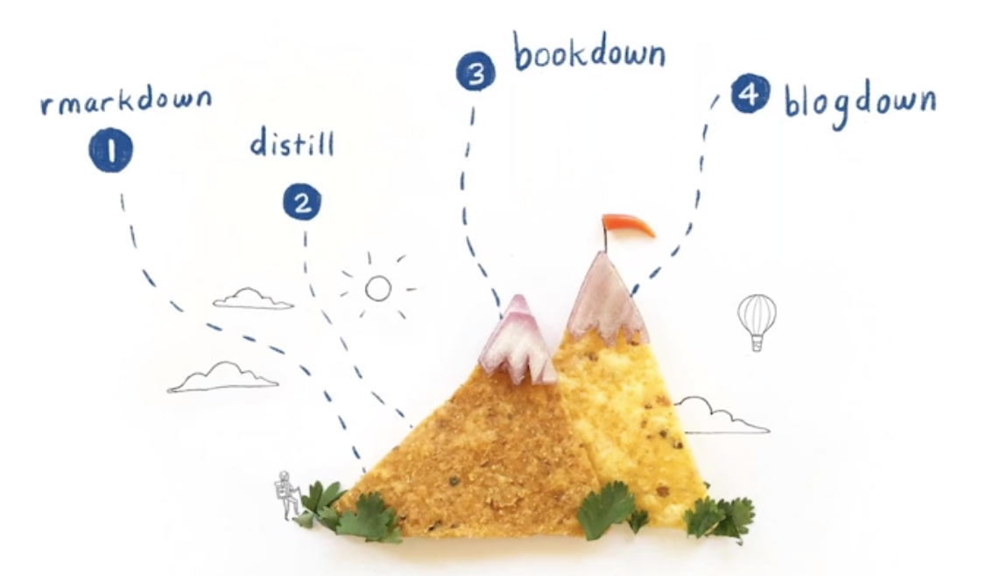

## Introduction

This post describes my journey to creating a personal website using the distill package. Along the way, I took some detours using R Markdown to create webpages and a website for a course I teach. This is not a how-to tutorial (although I will provide links to resources I used to help me along the way) but rather a reflection on why I made the choices I made. I hope this might help some of you decide which tools you might use in creating your own website.

## My blogdown fail

My journey with using the distill package to make a website began back in March of 2019 with the fancier, more customizable blogdown package. I had just gone through the [R Studio instructor training](https://education.rstudio.com/trainers/#info) and was about to be on spring break from my job teaching at Macalester College. The instructor training had me motivated to finally build a website and that break seemed like a perfect time to do it. At the time, the only tool I had heard of for doing such a thing was blogdown

Then, like many in the US and other parts of the world experienced, the news came that I would be teaching online for the rest of the semester, my husband would be working from home, and we'd have our elementary school kids home learning, too. So, creating my website took a backseat. I gave myself about 2 hours one afternoon to try to get a blogdown site up and running, but I kept getting bogged down in the details and quickly gave up.

I just looked back at my attempt and it's not as terrible as I initially thought. But, for me, the blogdown site was more than I needed. Ideally, I wanted something simpler, but what else was there?

## Hello R Markdown and Netlify!

Around that same time, I saw an advertisement for an R Studio webinar by Alison Hill and Desirée De Leon titled [Sharing on Short Notice: How to Get Your Materials Online With R Markdown](https://rstudio.com/resources/webinars/sharing-on-short-notice-how-to-get-your-materials-online-with-r-markdown/). Wow! The description sounded like just what I needed both for getting my personal website up and running and to help put R-related materials on the web in an easy way for my students. At the time, I was feeling overwhelmed with life (who wasn't?), so I didn't watch the webinar right away. Instead, I kept it open on a tab and tweeted out a reminder to myself:

<blockquote class="twitter-tweet">
I want to use this now but just can&#39;t find the time. But thanks for sharing. I&#39;ve added it to the summer to-do list. <a href="https://t.co/aDfLkivOkr">https://t.co/aDfLkivOkr</a>
&mdash; Dr. Lisa Lendway (@lisalendway) <a href="https://twitter.com/lisalendway/status/1245139228113227776?ref_src=twsrc%5Etfw">April 1, 2020</a></blockquote> 

Fast forward to mid-May 2020. My summer break had started, and one of the first things I did was finally watch the *Sharing on Short Notice* webinar. I loved their analogy of "Climbing R Markdown Mountain" and was surprised to learn that the two tools I had heard of, bookdown and blogdown, were two of the more complex tools. This webinar was also where I heard of [Netlify](https://www.netlify.com/) (a platform for easily deploying a website) for the first time.

It wasn't until August when I finally put the tools to action. I was in the thick of prepping course materials for my Introductory Data Science course. I knew I wanted to put them online both to make them easier for my students to access and to make them accessible to people other than my students. In the past, I had just uploaded either R Markdown files or knitted html files (with the Download Rmd option) to the course moodle site (moodle is a course management system). 

After watching the *Sharing on Short Notice* webinar a few more times, I decided to start at the base of the mountain, not even entering the website realm, by creating a single webpage from an R Markdown document. I did this for each topic in the course, ending up with five separate webpages for the course.You can see an example of my first site [here](https://ggplot-dplyr-intro.netlify.app/). This is NOT fancy, but it worked well for me for a couple reasons:

1. It was EASY! The only new skill I had to learn was how to deploy to Netlify. The process goes like this: Create an R Project (I also put it on GitHub) --> make the R Markdown document --> knit to html --> drop the project folder on Netlify (or, link to GitHub repo). It was very similar to what I had already been doing - uploading the files to moodle. To be honest, it was even easier! I only had to put a link to the Netlify webpage on the moodle page. And, because the Netlify page was deployed through my GitHub repository, changes to the document were automatically updated on the webpage when I pushed them out. 

2. I didn't need to think a lot about website design because each topic was just a single webpage. I did make sure to use the same theme throughout, but that was about as much as I thought about web design. This keeps the YAML simple, which I like for my intro students since many of them download the R Markdown code for the files. 

3. I could easily compartmentalize the different course topics because they were their own projects (separate folders) and their own webpages. After the first few weeks of the quarter, I was prepping course material in a just-in-time fashion, usually finishing the same day the students needed to use it. Having separate projects made it easy to forget about an old topic and move onto a new one.

This list of pros for using R Markdown webpages has many similarities to the corresponding list of cons:

1. Being able to easily compartmentalize topics meant making 5 (actually 6, if I include an R Basics page I use for multiple courses) different webpages! Yikes, that's a lot of webpages to manage and still required me to use the course management system to unite all the material together. Although I have folders organized fairly well, there are six smaller projects rather than one large project.  

2. The webpages feel a little "plain". This was purposeful because I wanted a simple YAML but perhaps a bit sad :(

## An R Markdown site

By the end of my first quarter of teaching, I was happy with the material I had produced and glad it was online where I could share it with a larger group, but I wanted to better unite the material. To do this, I started climbing "R Markdown Mountain". I chose the easiest hike and created an R Markdown website: [my course website](https://ds112-lendway.netlify.app/index.html). 

Although I was again tempted by some of the other options, I decided against them for the following reasons:

* Both blogdown and distill were going to require more thought than I had time for, including potentially making changes to the R Markdown file. I also wanted to keep the same theme (albeit a bit plain) for anyone who was already using the webpages, especially my students, which might require changing some CSS - I wasn't ready to delve into that yet, either.   

* Using the bookdown package seemed like a good option, but it would also require some changes to the R Markdown files and I could not figure out how to nicely add the code download button at the top of each chapter so students (and others) could download the R Markdown file for each topic. 

Truthfully, I also did quite a bit of "cheating" in my R Markdown website. One of the bad parts of an R Markdown website is that you can't have subfolders. Since my individual topic webpage projects each already had many files in them, this would have led to a very messy folder full of files. So, I just used the R Markdown site to unite all my individual webpages. Each topic still has its own webpage that is linked in the R Markdown website. I was able to create this site in well under an hour (yay!) and it serves its purpose for now.

<blockquote class="twitter-tweet">
I’ve finally put all my Intro Data Science materials in one place! It may not be the cutest website but it was quick to make. I hope the material might be useful to new <a href="https://twitter.com/hashtag/RStats?src=hash&amp;ref_src=twsrc%5Etfw">#RStats</a> users or people using R to teach data science. <a href="https://t.co/JkJMti8AEi">https://t.co/JkJMti8AEi</a>
&mdash; Dr. Lisa Lendway (@lisalendway) <a href="https://twitter.com/lisalendway/status/1330994486944600069?ref_src=twsrc%5Etfw">November 23, 2020</a></blockquote> 

When time allows, I will reinvestigate the organization of this website to try to make it more cohesive. 

## Distill it down

Remember, this journey began with me wanting to create a personal website. I felt a little overwhelmed with a blogdown site when I first tried it but also felt like that was the route I needed to go since many of the R blogs I visited were built using blogdown. A couple of things changed my mind:

* Watching the distill portion of *Sharing on Short Notice* a couple more times illustrated how simple it was to create a site.  

* Reading some of the [distill documentation](https://rstudio.github.io/distill/) confirmed that it was fairly easy to do.  

* Other distill sites I perused looked really nice! Two of my favorites are by [Ijeamaka Anyene](https://ijeamaka-anyene.netlify.app/) and [Shannon Pileggi, aka Piping Hot Data](https://www.pipinghotdata.com/). Shannon even tweeted about using distill!

<blockquote class="twitter-tweet">
I love the distill package! 🙌 🎊Distill empowered me to start sharing <a href="https://twitter.com/hashtag/rstats?src=hash&amp;ref_src=twsrc%5Etfw">#rstats</a> content 💪without the learning curve of blogdown/hugo 🗻. You can check out my distill backed blog at <a href="https://t.co/dLa6zI1iSb">https://t.co/dLa6zI1iSb</a>. <a href="https://t.co/Q0CzNl6oEm">https://t.co/Q0CzNl6oEm</a>
&mdash; Shannon Pileggi (@PipingHotData) <a href="https://twitter.com/PipingHotData/status/1336132591791996934?ref_src=twsrc%5Etfw">December 8, 2020</a></blockquote> 

* There was enough I could change about the website to make it look unique, but the defaults were a good start. My procrastination also seemed to pay off because new updates to the distill package made theming (customization, ie. font/title/background/navbar/etc. colors, sizes, styles, etc.) even easier with the `create_theme()` function. This function creates a CSS file with commonly used CSS selectors that you can easily change. You can change other CSS selectors, too, but you may need to know a little more about CSS to do that. If you're like me and are very unfamiliar with CSS, I would recommend only changing the defined ones first - there is plenty there!

After making the decision to go with distill to build my website, it was time to visit more resources. These are the ones I used most:

* Alison Hill and Desirée De Leon's [Sharing on Short Notice](https://rstudio.com/resources/webinars/sharing-on-short-notice-how-to-get-your-materials-online-with-r-markdown/). I've probably talked about this enough, but it is an amazing resource.

* The distill [documentation](https://rstudio.github.io/distill/), which also happens to be a ... distill website!  

* Thomas Mock's [distill how-to](https://themockup.blog/posts/2020-08-01-building-a-blog-with-distill/#step-7-add-to-git), which I wish I would have seen *before* starting to build my site rather than in the middle of it. 

* Alison Hill's [recent updates on theming](https://blog.rstudio.com/2020/12/07/distill/#theming), if you want to change the default theme. And read it thoroughly (I may not have done that the first time)!

* Other people's GitHub repos for their distill sites. The two I visited a lot were the corresponding repos for the sites I pointed out earlier: [Ijeamaka Anyene](https://github.com/Ijeamakaanyene/ijeamaka-anyene) and [Shannon Pileggi, aka Piping Hot Data](https://github.com/shannonpileggi/pipinghotdata_distill). This was a good way for me to dig into the code in more detail, and I could often copy, paste, and modify slightly to fit my needs.  

With these resources at hand and open in my web browser, I was able to get started on buildng the site. The first time I tried, I got stuck on the CSS theming (hence the recommendation to only modify the easy-to-modify selectors at first). Then, I re-read the [Create theme documentation](https://rstudio.github.io/distill/website.html#create-theme) (remember when I said to read that carefully the first time?), got a little help from [`@spcanelon`](https://twitter.com/spcanelon/status/1336320295129534464?s=20) on Twitter, and made a step-by-step guide for myself. The next day, I tried again, and had the website up and running within an hour! I documented this in detail on my first [blog post](https://lisalendway.netlify.app/posts/2020-12-09-buildingdistill/) on my distill website. The post also has embedded screencasts of me creating the site. 

I took some time after the video to further play around with customization, especially colors, most of which are inspired by William Morris's [Strawberry Thief](https://en.wikipedia.org/wiki/Strawberry_Thief_(William_Morris)) textile. I'm happy with the website's unique look combined with the simplicity. Each blog post has its own folder of files, so it is easy to stay organized. I like that blog posts are not re-rendered when the website is built. So, you need to knit each blog post and build the site in order for that blog to be updated, but you don't have to worry about code in an old blog post breaking the website. I am starting to think that distill may be the tool I use for future course websites for all these reasons. 

In conclusion, I hope I have given you some reason to check out distill for creating a website. Or maybe I've even helped you decide to use some of the simpler tools available. Either way, I wish you luck on your journey.

