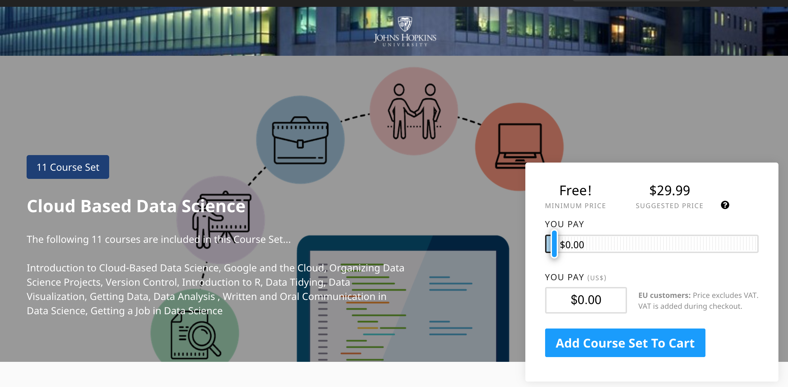
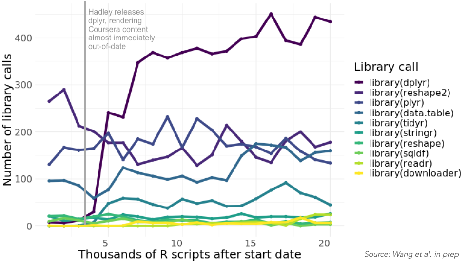

This is a story about one of my favorite topics: [Cloud-Based Data Science](https://www.clouddatascience.org/). We'll talk about what it is, its development history, and a _few_ associated pain points. Ultimately, I'm writing this so that I can propose a dream platform for online educational content that learns from our mistakes/ experience, in not-so-secret hopes that someone else builds it.

## Background

I'm now an Assistant Teaching Professor at UC San Diego. This means that I get to spend my days teaching, working with students and instructional staff members and thinking about how to do all of that better. It's pretty awesome. Okay, I also have to do all that less-than-fun administrative stuff that goes along with teaching really large undergraduate course, but naturally using R makes even most of that a bit easier. That's probably a different blog post though.

Anyway, before I started at UC San Diego, I was in Baltimore at Johns Hopkins Bloomberg School of Public Health working with the [Leek Group](http://jtleek.com/) and a [team of incredible people](https://www.clouddatascience.org/team) to make Cloud-Based Data Science (CBDS) a thing. You see, we had this dream of getting people who typically had limited to no access to data science education an education in data science for free, in a short period of time, and without any requirements for previous programming or advanced math training.

With the benefit of hindsight, this was kind of a wild dream. Regardless, I was all in. I spent a year solely focused on getting CBDS off the ground. Naturally, there was a whole team of people focused on making this happen, and our roles were distributed across the many moving pieces.[^1] Given my interest in education, it was a very natural fit that I (with others!) would focus on developing the content for the courses that would become the online program.

[^1]: Note that this blog post focuses on the education technology aspect of this project and doesn't even *touch* on the incredible work being carried out by Ashley Johnson (Program Administrator) and Simone Sawyer (Scholar Advocate), who deserve *so* much credit for managing and supporting the program and scholars since its launch, nor does it highlight the importance of HEBCAC (The Historic East Baltimore Community Action Coalition) and Edward Sabatino (Executive Director, HEBCAC), whose collaboration and insight have been critical for its success. For those interested, more has been write about the program implementation side [here](https://magazine.jhsph.edu/2019/data-science-careers-baltimores-underserved-community-members).

## CBDS: Goals

From the first discussions of this project we had a few non-negotiables. The content had to:

1. be completeable on a Chromebook
2. be plain-text
3. have videos that were _actually_ updateable

We wanted this content to be as accessible as possible. Chromebooks are available at most libraries and are _way_ more affordable than typical laptops. Jeff carried out a [proof of concept experiment](https://simplystatistics.org/2017/08/29/data-science-on-a-chromebook/), working exclusively on a Chromebook for months to ensure that doing data science is possible on a Chromebook. With positive results, we were committed. So committed in fact, we initially named the program Chromebook Data Science, which was later changed to Cloud-Based Data Science [^2]. Regardless, it was settled: anyone with an Internet connection would be able to complete this program.

[^2]: We're not marketers. We didn't really consider the fact that Chromebook Data Science makes it sound like you _need_ a Chromebook, not just that it's _possible_ to complete a Chromebook. This probably should have been more obvious to us.

For the second two non-negotiables, these were largely informed by our previous development of the [Data Science Specialization](https://www.coursera.org/specializations/jhu-data-science) -- a popular MOOC hosted on the Coursera Platform.

Jeff Leek tells a great story about how the Data Science Specialization team released their MOOC, only for Hadley Wickham to release `dplyr` *right* after their initial launch. This meant that a lot of the code and examples presented in the MOOC were (almost instantly) out-of-date.

This happens frequently with online courses because to update MOOCs, you typically have to not only interact with a proprietary platform to update content but you also have to spend hours in front of the camera to re-record and edit videos.

We wanted those issues to be things of the past.

For this CBDS endeavor, we planned to develop the content on a platform that allowed all of the content to be plain text. This would thus enable us to generate automated videos that would be re-compileable in an instant, rather than re-recorded in a painful and time-consuming manner.

For the plain text, we turned to [Leanpub](https://leanpub.com/). While their experience has historically been as an online publisher of books, they were developing their courses platform at the same time we were developing CBDS. Their platform allowed everything to be written in [Markua](https://leanpub.com/markua/read), which is a slightly-specialized Markdown syntax.

As for the videos, that didn't exist yet. Pain point number 1.

## Pain Points

With eye on our goal (make the thing!) and our non-negotiables determined (plain text, no recording videos, and could be completed on a Chromebook), we were ready to start building. And, that's really what this blog post sets out to discuss. For some context, this post is largely borne out of a conversation that [Alison Hill](https://alison.rbind.io/) and I had a few months back where we discussed the pains of developing and maintaining online educational content. We both love teaching and have both, on completely separate platforms for completely different projects, run into very similar issues.

This post aims to discuss those issues, explaining all the moving pieces and pain points that surround developing the educational content we're most interested in developing. After discussing and explaining these pain points, I'll lay out what my dream for educational content development would be. (Y'all I'm not-so-secretly laying out these pain points along with my dream in hopes that someone who is a better engineer than I am reads this and builds my dream. If you do, I ask for no credit, but I want a heads up, so I can start using/testing it. As they say, if you dream it, they will build it. That's the saying, right?)

### Pain Point #1 - Automated videos: `ari`

The first pain point was solved fairly early in the process by [Sean Kross](http://seankross.com/) when he developed [`ari`](https://github.com/jhudsl/ari).

We knew we didn't want to stand in front of a camera and record videos. We knew we wanted them to be generated computationally. That just wasn't _actually_ possible.

Then, in what seemed like a weekend, we went from musing about being able to take images and text that automatically generate a video to Sean developing `ari`, which did precisely that.

While discussing this solution, I'll note however that working with a new technology is never without hurdles of its own. A dependency on [`ffmpeg`](https://ffmpeg.org/) led to [John Muschelli](https://johnmuschelli.com/) and I (okay, mostly John) staring at errors and reading documentation to figure out what was going on and how `ffmpeg` had to be installed to actually work on my machine. Something about an autoencoder. Or a compiler. I can't remember. I saw a lot of error messages, and John worked his magic to fix them.

### Pain Point #2 - Plain-text compilation

In realizing our plain-text educational content development dream, we worked with Leanpub, which was _wonderful_. I don't know a team of more helpful and responsive [^3]. Despite their awesomeness, as noted above, when things are new, they're new.

[^3]: On a train ride from Baltimore to Boston I found a bug that caused our lesson on how to write functions to show code for precisely zero functions. I reported this bug on our slack channel with our awesome Leanpub people, not realizing it was Thanksgiving in Canada, where the Leanpub team lives and works. Upon realizing that, I asked the team not to worry about the bug, but they assured me that they were done with their family time and had finished their celebrations. The bug was fixed that day.

For us, this meant that everything worked well, as long as I didn't make any mistakes. If I missed a `?` in quiz development or a `{` somewhere to specify the course settings, compilation of the course would fail. Leanpub would let me know that it failed, but their error messages were not always the most helpful. I wouldn't always know in which file the error was encountered, let alone the line. So, it involved a lot of me staring at files until I figured out which one was causing the problem.

For sure in time (and much already has) Leanpub will improve these error messages, but it was early on. We wanted to use a new platform. With this, we gained a ton of flexibility but also a few bumps in the road. While plain-text development became a reality (yay!), we had to work through some compilation headaches (worth it.).

### Pain Point #3 - Tracking all the things

I'll note that issues with the Markua syntax during development were not the only compilation issues. Our compilation issues were by _no means_ only on Leanpub. I haven't _quite_ made clear yet just how many pieces there were for each course.

For each course, there are approximately 12 lessons.

Each lesson contains:

- the text that becomes the lesson on Leanpub
- the text that becomes the words in the video
- the images that are used in the video and the lesson on Leanpub
- the compiled video

Assuming that there are 15 images in a lesson (a conservative estimate for sure), for each course there would be ~24 different text files, 180 images, and 12 videos.

And there were 12 courses. So, 288 text files, 2,000+ images, and 144 videos.

Every time we found a typo, text was edited, videos were recompiled and re-uploaded to YouTube, and the lessons were recompiled on Leanpub.

There were a lot of moving parts, and we needed a way to keep track of everything.

For example, let's think about the videos. If the text in a video file has been updated since the last time the video was compiled, then the video needs to be recompiled. If the video has been recompiled since the last time it was uploaded to YouTube, it has to be re-uploaded to YouTube. Then, once that happens, we need to be sure the URL for the YouTube video in the lesson is updated, so that the right video shows up in the lesson, which means, we need to recompile on Leanpub.

And, that's just the videos.

There was a lot to keep track of.

Enter: [John Muschelli](https://johnmuschelli.com/) (again) and [`didactr`](https://github.com/jhudsl/didactr).

John Muschelli developed `didactr` after I had been building content for three months, so I know _just_ how helpful `didactr` was. `didactr` was initially developed to help track all the pieces of a course. This means it was used to:

- determine if all images mentioned in a lesson actually exist
- check to see if the images and text for a video line up
- use images from Google Slides[^4] for videos
- generate videos if needed
- upload videos to YouTube
- update YouTube links in lessons
- etc.

[^4]: Did I not mention we used Google Slides for our images? It was the best way we knew how to keep images in order, and it allowed us to link to the images directly rather than hosting all our bazillion images on GitHub.

The pain point was tracking all the pieces. John addressed that with `didactr`. Then, YouTube gave us the big ole' no ma'am when it capped the amount of videos that can be uploaded in a day. Whenever we do a large update now, using YouTube's API is not an option. We'll call that pain point #3.5. It's still a pain point. I manually updated all the videos for our last large update. And, because I'm human, I'm sure I made some mistakes. I trust the Internet will let me know. The Internet _always_ lets you know.

### Pain Point #4 - Delivering on non-negotiable #1

Remember that theme of using new things? Well, what made CBDS possible at all, was RStudio's release of [RStudio Cloud](https://login.rstudio.cloud/), which was in alpha when we started CBDS development. Like Leanpub, the RStudio Cloud team was _amazing_. They were totally on board when we pitched CBDS to them, in which we said something along the lines of: "Well, we don't really have any idea of how many users we'll have. Could be 10. Could be 10,000."

RStudio Cloud was not a pain point in and of itself. I think RStudio Cloud is a _game changer_. But, while cloud-based products get rid of the need to deal with software installations and general [command line bullshittery](http://www.pgbovine.net/command-line-bullshittery.htm), you're at the mercy of the application. When RStudio Cloud is down, it's _down_. There's no getting around it. This happens less and less over time as the product gains stability, but early on, this was a pain point.

It was particularly problematic when we were doing in-person tutoring for our adjacent [CBDS+](https://www.clouddatascience.org/forlearners) program. For these, we provided scholars with Chromebooks to complete the program. When RStudio Cloud was down, work was down.

### Pain Point #5 - Bug Fixes

Let's just continue with my new thing theme. CBDS is still new. This means _we_, like all the new technologies mentioned so far, have bugs too. I've done my very best to keep up with them (as the whole team has). I've fixed typos (including my infuriating inability to correctly type the word individual more times than I can count). I've fixed quiz errors. I've removed content. I've added content.

And, maybe most frustratingly, I fixed the bug caused when the new version of R's `sample()` function was not backward-compatible. With a single update, ~80% of our quizzes were rendered unable to be completed, as they would mark the correct answer as incorrect every time. Cloud-based products are awesome, but you don't get to necessarily control when updates occur. Nor, do you always remember to test things immediately after updates. Come to think of this, I should have way more tests in place than I actually do...

### Pain Point #6 - Assessment

I mentioned the breaking `sample()` change that occurred with the R update. The reason this was so problematic is because we have a sub-optimal approach to assessing learning.

We originally used a third-party company for extra programming practice. This means that learners would answer quiz questions on Leanpub and would have the option to get outside practice on a different (paid) platform. It was free to participants in our CBDS+ program, but not to the rest of the world.

This means you could (initially) complete the program without _really_ getting true practice with the hands-on portion of the curriculum. Certainly less than ideal.

We scrapped the outside company in favor of a system where learners get practice using [`swirl`](https://swirlstats.com/) on RStudio Cloud. This involves learners completing a swirl module and then, upon completion, receiving a code. This code is then the "answer" to the quiz on Leanpub.

While this has been a huge improvement to our initial approach, it's still not seamless. Learners have to leave the course material, go to RStudio Cloud, complete the practice, copy the code, and get the credit. Not. Ideal.

## The Dream

Y'all I'm writing all of this down to spell out the fact that I absolutely still _love_ this project _in spite of_ these hurdles. I think we've built something really special. I think the speed at which we were able to develop it all is impressive [^5].  *All that said*, it is _so_ far from perfect, but it is special. CBDS is doing something hard. Teaching programming online is tough. Teaching data science to people with no background is important. And, we're doing that.

[^5]: This is me bragging on the rest of the team, not on myself.

But...BUT...we can do it better. Here's my dream of what that would look like from the development side.

My dream platform would be a platform with which I'm already familiar (::cough:: RStudio ::cough::) because who wants to learn another NEW platform? Developing in RStudio is my happy place, and this is my dream. So, I'd want this to be developed within RStudio.

Within this dream platform, there would be a way to develop **adaptive content** for lessons. For example, for people struggling with a certain concept, they would get additional detail and extra practice questions before moving on to the next section. People who have got the concept down pat would move on directly. This would be specified within a text-based format.

This platform would allow **code to be run and tested (think quiz questions) directly within the lesson on the platform** as learners are taking it. No separate platform. Code would be written and feedback provided right then and there.

It would also allow larger projects to happen as they would in the wild. For example, **projects would be completed in a separate RStudio Cloud Workspace** to ensure learners were getting comfortable outside of the educational platform in what they'll be using after they complete the course. These projects would also provide learners with magical feedback that helps them improve going forward.

Videos of production-quality would be created and edited in some magically short period of time. Okay, maybe that's gone too far. Maybe we would just be able to **include `ari` videos**. That would be acceptable in my dream.

Images would be able to be inserted with each and maybe even **dragged and dropped into place**. (Yeah. I said it.) In this dream world, they would magically self-organize.

During development, there would be a **Viewer preview of what the compiled course** would look like. This would allow for interaction and testing directly within RStudio (have I convinced you future developer that this platform has to be RStudio yet?). Error messages during compilation would be brilliantly precise, pointing me directly to where my fingers led me astray during development. (It's probably got something to do with my inability to type individual.)

Beyond development (because this is my dream), this platform would **track user habits and pain points**, to make bug fixes and educational improvement more seamless. Right now, I'm pretty limited to quiz scores and bug reports. Granted, Leanpub has more, but I don't have access to that. As an educator, I want to improve my stuff, so having access to this information would be super helpful. (And maybe a dashboard per course summarizing user information would be great....that may be going too far?) I've gone too far. I'll stop my dreaming there.

So...if we could make this dream into a reality, I would _happily_ test it out and find all the pain points to write about in a future dream-realized blog post.
