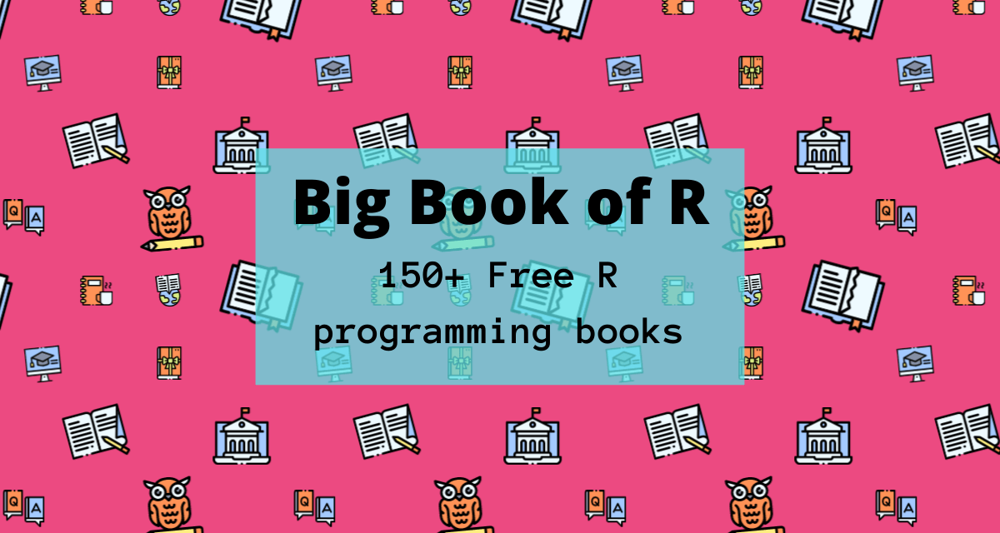
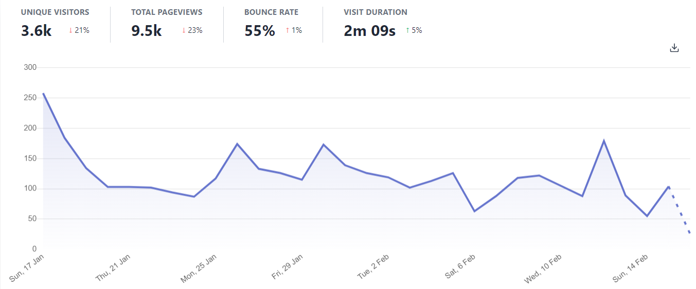

# Big Book of R: The making of your last-ever bookmark

I'm really excited to share some "behind the scenes" with you of the making of Big Book of R. I'll also share where I see gaps in the content needed to help spread the good word of R far and wide, and what the near future might hold.

## The back-story

So what is Big Book of R? It's basically a massive library of R-related books. As far as I can tell, it's the biggest single repo of its kind. I apply some light curation to it, including categorization to help people find topics of interest.

Way back in \~September of 2018, I was just getting into R and bookmarked my very first R programming book: [R for Data Science (R4DS)](https://www.bigbookofr.com/data-science.html#r-for-data-science) by Hadley Wickham and Garrett Grolemund. I recall at the time it was [Jesse Mostipak](https://twitter.com/kierisi) tweeting about R and R4DS that made me curious to try it. I had just been struggling to plot something in Python and when I reached the section in R4DS covering *facet_wrap*, I was hooked!

Over the next two years I got slowly more involved in the R community, bookmarking books as I came across them in twitter posts. I've dabbled in other programming languages before, but the abundance of high-quality, free R books really blew me away.

I was diligently collecting books and after quite some time I was thinking that I might have something fellow R programmers might find useful, if nothing more than it being quite an extensive collection. By early August 2020, I had about 80 books and did a quick check to see where on the spectrum of bookmark-hoarding I sat.

<blockquote class="twitter-tweet">
Might be some really valuable ressource if categorized and put on git or so
&mdash; Niels Ohlsen (@Niels_Bremen) <a href="https://twitter.com/Niels_Bremen/status/1295762623405985794?ref_src=twsrc%5Etfw">August 18, 2020</a></blockquote>

<blockquote class="twitter-tweet">
Wow! You should <a href="https://t.co/EfLRIqx3wL">https://t.co/EfLRIqx3wL</a> our slack and participate in (and/or lead) some book clubs 😁
&mdash; Jon Harmon (@JonTheGeek) <a href="https://twitter.com/JonTheGeek/status/1295442214164869121?ref_src=twsrc%5Etfw">August 17, 2020</a></blockquote>

I didn't get many replies but John's response had me thinking that maybe this was quite a high number. You'll also notice Niels' little nudge which had me initially thinking that maybe I should share this with others. I liked the idea of categorizing the books to make the list more valuable, as I had already noted that just lists of info are useful but not super effective.

## The Writing Montage

With the decision made to share my stash and add some value by categorizing everything, I set to "writing" the book. I opted to do it using {bookdown} for a few reasons:

1.  It felt a fitting homage as basically ALL of the books in the collection were written in bookdown and I wanted to give it the same look and feel for a better user experience.
2.  I already had some experience having co-authored [Twitter for R programmers](https://www.bigbookofr.com/career-community.html#twitter-for-r-programmers) earlier in the year with [Veerle van Son](https://twitter.com/veerlevanson) using {bookdown} and I was comfortable with the basics.
3.  It lent itself to open source collaboration. I had used Git with Veerle on our book (with just her and I as co-creators) and this was an opportunity for me to get a step up in experience when strangers would (hopefully) submit PRs.

The first release was a quite basic version of the site, having just the title, authors and the URL listed for each book. This was a good decision because it only took me a few hours over a couple of days to put the book together.

Since then, I've added authors and descriptions, and of course a whole lot of people have contributed books and typo fixes. At the time of the initial publication, I had about 100 books in the collection, and as of February 2021 this stands at \~180 books. Most are free, and those that aren't are generally affordable. Not all are strictly R related, but I exercise some editorial discretion to include books that I think are useful to R programmers, or once in a while, a non-book resource.

It wasn't until much later that I created the banner and social media preview images, which I think have a really fun and eye catching design to them.

## Big Gaps

At over 180 titles, you might be thinking that there aren't any topics left to write about, but I can assure you we're not even at 1% of what we need if we want to make R even more widely accessible and useful to new and experienced programmers alike.

Some of the most obvious gaps I can see are:

1.  **Sports analytics**: There's just a few titles available, but I see sports analysis as a really great, un-intimidating on-ramp for stats-enthused, performance-quantifying sports nerds to start using R.
2.  **Package manuals**: Manuals for packages are slightly different from API references and vignettes. They contain more fleshed out examples of how to use the package in a variety of practical use cases. They can of course be tailored to different skills levels as well. The only example I've really seen of this is for the {validate} package. I think more of the sort of "cookbook" idea applies, but with slightly deeper content, and more focused scope.
3.  **Version control for specific system and organisational setups**: Considering how tricky the practice of Version Control is, I hoped there'd be a lot more reference guides about it. Particularly for different system setups and use cases. The scope of potential titles has barely been touched e.g. I'm on a windows machine, working with 3 collaborators and we're all clueless - that could be a mini guide right there! Short technical guidebooks and Zines Lots of books aim to cover quite a lot, but I think there's very few that pack just the absolute essentials into a very short format. A good example is [Lucy D'Agostino McGowan](https://twitter.com/LucyStats)'s [GGplot2 in 2](https://www.bigbookofr.com/data-visualization.html#ggplot2-in-2) which aims to cover the basics of the package in 2 hours. For a non-R example's, check out the awesome [Wizard Zines](https://wizardzines.com/) from Julia Evans for inspiration.
4.  **Data science for very specific situations**: Most of the Data Science resources talk very broadly about applying general data science practices, but again I think more specific books dealing with more narrow ranges of organizational data maturity, number of data teammates and scope of work is more or less un-addressed. Example: I am in a team of 2 data professionals, at a company of \~250 people, we're the first ones, there's a lot of spreadsheets, we want to move to the cloud. This is my current life story which I may well write myself (but write yours too!)
5.  **Generative art**: It's awesome, so diverse and loads of fun! Why no books yet?

That's really just off the top of my head having looked at what's available. I'm sure there are many more I could have added!

## My unsolicited opinion re Free vs Paid resources

I think one hindrance to many books being published is that people can't afford to (or just don't want to) put the time into writing a book if there's no monetary compensation for it. While I appreciate that many educational resources are free, I also strongly believe that anyone making content should be able to earn money from it if they want to. There's of course a balance that needs to be struck, and there's various ways to do it, but all in all I am very supportive of both free and paid content - hence you'll find both options in Big Book of R.

## What the Near Future holds for books and the Big Book of R

I think (hope) we are going to see many more first time authors, with a huge part in this thanks to RStudio's [markdown preview](https://blog.rstudio.com/2020/09/30/rstudio-v1-4-preview-visual-markdown-editing/) functionality. I've found it really difficult to write in the "code" text style and I think this must be a big hindrance for people attempting to write books in a format that looks and feels completely different from a word processor.

I'll continue maintaining the Big Book of R, adding more books and other resources as we go. There's some alphabetizing of books to do and additional housekeeping, but for the time being I think most of the effort should go into promoting the site and helping more people to find it.

What I really hope is that authors see an increase in the use of their books now that people have a much easier way of finding them, and hopefully this encourages them to write even more books :).

Some authors also seem a bit shy to submit their own books. Please don't be! Just submit ait, or ask me a question if you feel unsure about where a book should be added. I also encourage works-in-progress to be submitted. Early feedback can be really helpful while you're writing it out.

## Results so far

Big Book of R has been a great success so far. As of now the site stats show that about that there have been about 30 000 unique visitors since it was launched. That's really awesome!

## Bonus announcement - Publicly Available Site Analytics!

For those who've read this far, here's a little extra tidbit for you :).

Given that most people reading R books probably like data too, I've decided to make the site stats openly available :D. I've recently switched from Google Analytics to Plausible analytics to enhance the privacy of site users, which means that unfortunately the data is now split between the two. I think in the fullness of time however that the "loss" of the Google data won't really matter.

You can explore all sorts of cool data like site visitor numbers, operating systems, and outbound link (i.e. book link) clicks.

For more info, visit the [Live Stats](https://www.bigbookofr.com/index.html#live-stats) in Big Book of R.

## Want more?

The best way to stay in touch with developments to the site and learn about any other products I create is to link up with me on [Twitter](https://twitter.com/OscarBaruffa) (I tweet a fair amount) and subscribe to my [newsletter](https://oscarbaruffa.com/newsletter/) (I don't post too often :) ).

Also know that I get a very welcome dopamine hit with every new follower and subscriber \<3.
