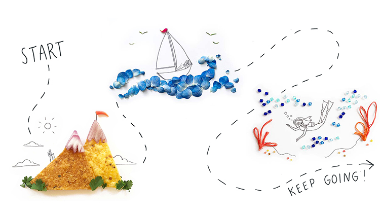

We think R is a great place to start your data science journey because it is an environment designed for data science. R is not just a programming language, but it is also an interactive ecosystem including a runtime, libraries, development environments, and extensions. All these features help you think about problems as a data scientist, while supporting fluent interaction between your brain and the computer.

However, after more than 25 years of development, the R ecosystem can seem overwhelming to newcomers. Whether you are just beginning R or have many years of data science experience, R offers a plethora of choice. Yet, when RStudio asks students about their biggest challenges in learning R, respondents overwhelmingly answer that survey question with another question: where should they begin?

Most journeys begin with a map. Here's ours:

We have created three tracks to help learners navigate the R ecosystem. These tracks are not meant to be exhaustive, but instead are designed to help you become productive in the minimum amount of time, based on your experience level. 

## Choose your learning path {#paths}

